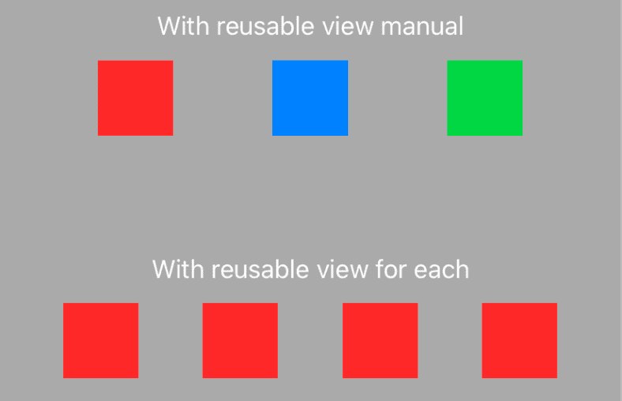

# EquallySpacedStack

This package provides two new Views: `EquallySpacedHStack` and `EquallySpacedVStack`. They behave like their respective Stacks but distribute the subviews by adding equal space between them.

## Status

This package is work in progress. I'm still trying to figure out the best way of doing custom layouts in SwiftUI.

If you want to follow the process you can read my blog or [follow me](https://twitter.com/alexito4) on Twitter:
- [Trying to understand custom layouts in SwiftUI](https://alejandromp.com/blog/2019/06/12/custom-layouts-in-swiftui/)
- [SwiftUI TupleView and equally spaced stacks](https://alejandromp.com/blog/2019/06/13/implementing-a-equally-spaced-stack-in-swiftui-thanks-to-tupleview/)

## Usage

Just replace `HStack` or `VStack` with `EquallySpacedHStack` or `EquallySpacedVStack`:

```
EquallySpacedHStack {
    Color.red.frame(width: 50, height: 50)
    Color.blue.frame(width: 50, height: 50)
    Color.green.frame(width: 50, height: 50)
}
```
you can also use `ForEach`:

```
EquallySpacedHStack {
    ForEach(1...4) { _ in
        Color.red.frame(width: 50, height: 50)
    }
}
```



## WIP

- [ ] Avoid issue when using more than the supported number of nested subviews.
- [ ] Support more nested subviews (max is now 4)
- [ ] Avoid using the type erased `AnyView`

## Contributions & support

This project is developed completely in the open, and your contributions are more than welcome.

This project does not come with GitHub Issues-based support, and users are instead encouraged to become active participants in its continued development — by fixing any bugs that they encounter, or improving the documentation wherever it’s found to be lacking.

If you wish to make a change, [open a Pull Request](https://github.com/alexito4/EquallySpacedStack/pull/new) — even if it just contains a draft of the changes you’re planning, or a test that reproduces an issue — and we can discuss it further from there.

## Author

Alejandro Martinez | http://alejandromp.com | [@alexito4](https://twitter.com/alexito4)
